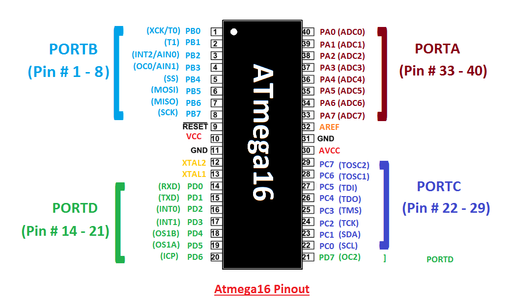
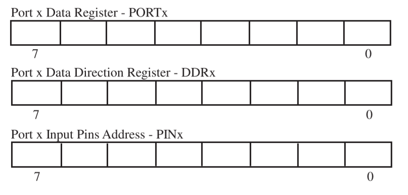
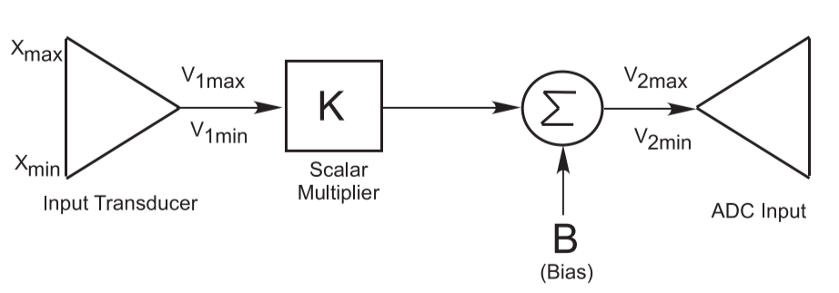
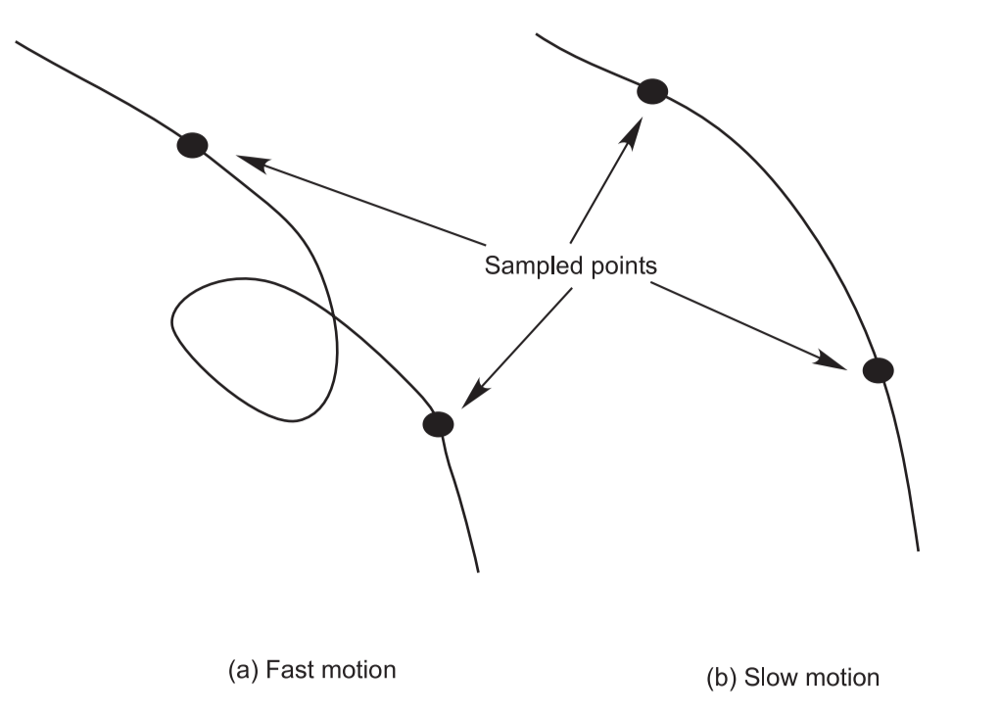
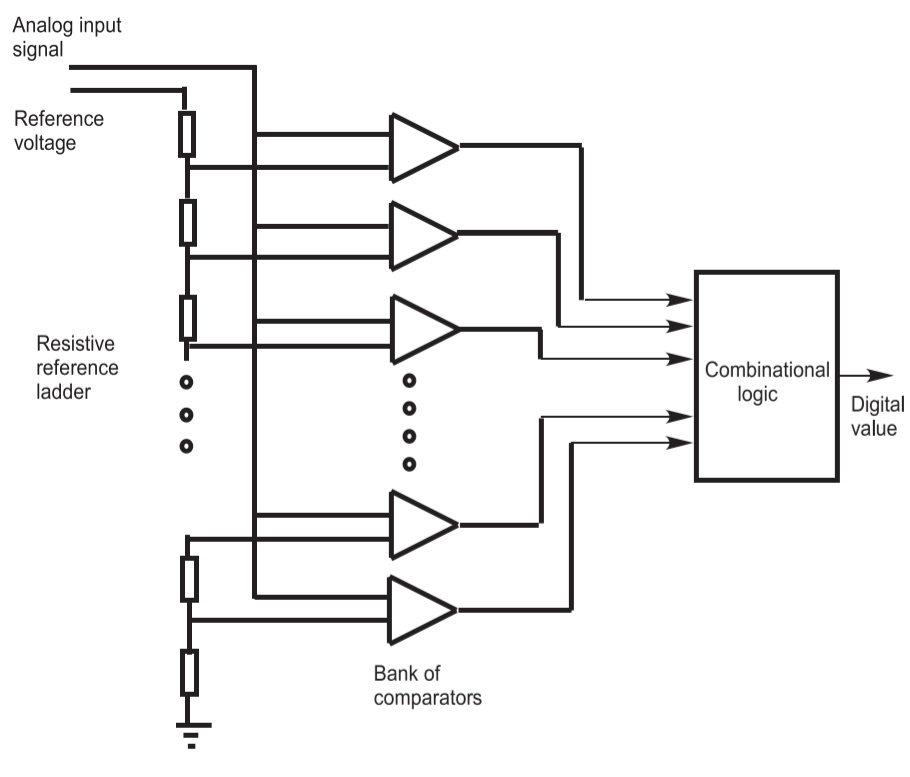
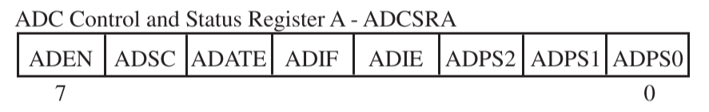

[TOC]

# Chapter 1 AVR Architecture Overview

## 1-1 Introduction

### AVR Classifications

- Classic AVR
- **Mega AVR**
- Tiny AVR
- Special purpose AVR

<div align = center></div>

### AVR Features

- an 8-bit **RISC**[^1] micro controller with *Harvard Architecture*[^2]
- high performance with low power
- has a CPU
- has program ROM, RAM, [EEPROM](#eeprom), Timers and I/O ports
- owns ADC and PWM
- owns serial interfaces: USART, SPI, TWI, etc

## 1-2 ATmega16 Architecture Overview

### RISC Architecture

- **131** RISC-type instructions
- **32** general purpose 8-bit registers
- operates at a clock speed of **16 MHz** or handles 16 million instructions per second

### Assembly Language Instruction Set

- the most efficient and fast execution for a particular micro controller
- need to be familiar with the low-level architecture details of the controller
- C language is easier to read and transfer

### ATmega16 Architecture Overview

<div align = center></div>

- a timer subsystem
- a communication system
- an interrupt subsystem
- an analog-to-digital converter (ADC)
- memory components

#### Pins

- four 8-bit ports (PORTx)
- connections for power supplies (VCC/GND/AVCC/AREF)
- external time base input pins (XTAL1/XTAL2)
- processor reset (RESET)

## 1-3 Memory Components

### EEPROM

**EEPROM**, stands for electrically erasable programmable read-only memory and is a type of **non-volatile** memory used in computers, integrated in micro controllers for smart cards and remote keyless systems, and other electronic devices to store relatively small amounts of data by allowing individual bytes to be erased and reprogrammed.

#### Programmable Flash EEPROM

- 16K bytes
- 10 000 write/erase cycles
- stores on-chip boot program

#### Byte-Addressable EEPROM

- 512 bytes
- 100 000 write/erase cycles
- logs system malfunctions and fault data during program execution
- stores data must be retained during a power failure but might need to be changed periodically

### SRAM

Static random-access memory (static RAM or **SRAM**) is a type of random-access memory (RAM) that uses latching circuitry (flip-flop) to store each bit. SRAM is **volatile** memory; data is lost when power is removed.[^3]

- 1000 bytes
- read and be written data during program execution
- protected by programming lock

### Programmable Lock Bits

- six memory lock bits for memory security from tampering
- Atmel STK500 programming board used to program lock bits

## 1-4 Port System

ATmega16 is equipped with **four** 8-bit general-purpose, digital I/O ports designated PORTA, PORTB, PORTC, and PORTD. And each port has **8 data pins** and is bi-directional.

<div align = center></div>

### Data Register

PORTx, used to write output data to the port

### Data Direction Register

DDRx, used to set specific port pin to either output (1) or input (0)

### Input Pin Address

PINx, used to read input data from the port

<div align = center></div>

### Port Pin Configuration

| DDRxn | PORTxn |  I/O   |                 Comment                 |
| :---: | :----: | :----: | :-------------------------------------: |
|   0   |   0    | input  |            Tri-state (Hi-Z)             |
|   0   |   1    | input  | source current if externally pulled low |
|   1   |   0    | output |            Output Low (Sink)            |
|   1   |   1    | output |          Output High (Source)           |

- x: port designator (A, B, C, D)
- n: pin designator (0 - 7)

#### Input Pin

- the pull-up resistor is **activated** when PORTxn is written **logic one**
- the pull-up resistor is **off** when PORTxn is written **logic zero** or configure the pin as the **output mode**

#### Output Pin

- the port is driven **high** when PORTxn is written **logic one**
- the port is drive **low** when PORTxn is written **logic zero**

## 1-5 Internal Subsystems

### Time Base

Time base, also called as the clock, controls the speed at which a micro controller sequences through accomplishing instruction related operations

- User-selectable resistor capacitor time base is used **internally**
- **External time sources** is used to increase accuracy and stability
- Fixed clock operating frequency of **1, 2, 4 or 8** MHz

### Timing Subsystem

The ATmega16 is equipped with **two** 8-bit timer/counters and **one** 16-bit timer/counter

- generate a precision output signal
- measure the characteristics of an incoming digital signal
- count external events

### Pulse Width Modulation Channels

The ATmega16 is equipped with **four** PWM channels, allows the user to generate a wide variety of PWM signals

### Serial Communications

Three serial communication subsystems of ATmega16 

- Universal Synchronous and Asynchronous Serial Receiver and Transmitter(**USART**)
- Serial Peripheral Interface (**SPI**)
- Two-Wire Serial Interface (**TWI**)

> All of three are **serial transmission** of data

### Analog-to-Digital Converter

The ATmega16 is equipped with an **eight-channel** ADC subsystem, which has **10-bit** resolution which means that an analog voltage between 0 and 5V will be encoded into one of $2^{10}=1024$ binary representations.

### Interrupts

The ATmega16 is equipped with a complement of **21 interrupt sources**[^4]

- **three of the interrupts** are provided for external interrupts
- **remaining 18 interrupts** support the efficient operation of peripheral subsystems

[^1]: 
    **RISC**, acronym for Reduced-instruction-set Computing, information processing using any of a family of microprocessors that are designed to execute computing tasks with the simplest instructions in the shortest amount of time possible. RISC is the opposite of **CISC** (Complex-instruction-set Computing).
[^2]:
    **Harvard architecture** is a computer architecture with separate storage and signal pathways for instructions and data. It contrasts with the **von Neumann architecture**, where program instructions and data share the same memory and pathways.
[^3]:
    The term static differentiates **SRAM** from **DRAM** (dynamic random-access memory) which must be **periodically** refreshed. SRAM is faster and more expensive than DRAM; it is typically used for the cache and internal registers of a CPU while DRAM is used for a computer's main memory.
[^4]:
    When these higher-priority events occur, the micro controller must temporarily suspend normal operation and execute event specific actions, called an **interrupt service routine**.

# Chapter 2 Serial Communication Subsystem

## 2-1 Serial Communications

Micro controllers transfer data in two ways: **parallel** and **serial**

- parallel: several data bits are transferred simultaneously
- serial: a single data bit is transferred at one time

Advantages of serial communication

- longer distances
- easier to synchronize
- fewer I/O pins and lower cost

Serial communication often requires

- **shift registers**: convert a byte to a serial bits and vice versa
- **modems**: modulate/demodulate serial bits to/from audio tones

## 2-2 Serial Communication Terminology

### Asynchronous versus Synchronous

- Synchronous serial communication
  - the clocks of the sender and receiver are synchronized
  - a clock of characters, enclosed by synchronizing bytes, is sent at a time
  - faster transfer and less overhead
- Asynchronous serial communication
  - the clocks of the sender and receiver are not synchronized
  - one character is sent at a time, enclosed between a start bit and one or two stop bits, a parity bit may be included

### Baud Rate

Data transmission rates are typically specified as a **baud** or bits per second rate

### Full Duplex

A **single duplex** system has a single complement of hardware that must be switched from transmission to reception configuration

A **full duplex** serial communication system has separate hardware for transmission and reception

### Nonreturn to Zero Coding Format

The ATmega16 uses a **nonreturn to zero coding** standard, coding a logic 1 is signaled by a logic high during the entire time slot allocated for a single bit, whereas a logic 0 is signaled by a logic low during the entire time slot allocated for a single bit.

### RS-232 Communication Protocol

The RS-232 is a widely used standard for serial interfacing, which covers four main aspects

- Electrical: voltage level, rise and fall time, data rate and distance
- Functional: function of each signal
- Mechanical: number of pins, shape and dimension of connectors
- Procedural: sequence of events for transmitting data

| Logic | RS-232 Levels |  TTL Levels  |
| :---: | :-----------: | :----------: |
|   1   | $[-15V,-3V]$  | $[+2V,+5V]$  |
|   0   | $[+3V,+15V]$  | $[0V,+0.8V]$ |

### Parity

- Parity Bit: a single bit for error checking, sent with data bits to make the total number of 1's
- Start Bit: the **indication** of the start of a character
- Stop Bit: the **indication** of the end of a character

## 2-3 Serial USART

### Hardware Elements

There are mainly **four** basic pieces in USART

- the clock generator
- the transmission hardware
- the receiver hardware
- three control registers (UCSRA, UCSRB and UCSRC)

#### Clock Generator

- provide clock source
- set **baud rate** using UBRR register

#### Transmitter

- send a character through **TxD** pin
- handle start/stop bits and parity bit, and shift register

#### Receiver

- receive a character through **RxD** pin
- perform the reverse operation of the transmitter

#### Registers

- configure, control and monitor the serial USART

### Registers

#### Baud Rate Registers

<div align = center></div>

| Bit Number | Register Bit |    Register Bit Name     |                                   Function                                    |
| :--------: | :----------: | :----------------------: | :---------------------------------------------------------------------------: |
|     15     |    URSEL     |     Register Select      | Must be set to 0 to write to UBRRH, which shares the same location with UCSRC |
|   14:12    |              |      Reversed Bits       |                    Theses bits are reserved for future use                    |
|    11:0    |  UBRR 11:0   | USART Baud Rate Register |         This is a 12-bit register which contains the USART baud rate          |

The following table contains the equations for calculating baud rate register setting

|             Operating Mode             |               Calculate Baud Rate               |             Calculate UBRR Value              |
| :------------------------------------: | :---------------------------------------------: | :-------------------------------------------: |
| Asynchronous Normal ($\text{U2X} = 0$) | $\text{BAUD}=\frac{f_{OSC}}{16(\text{UBRR}+1)}$ | $\text{UBRR}=\frac{f_{OSC}}{16\text{BAUD}}-1$ |
| Asynchronous Double ($\text{U2X} = 1$) | $\text{BAUD}=\frac{f_{OSC}}{8(\text{UBRR}+1)}$  | $\text{UBRR}=\frac{f_{OSC}}{8\text{BAUD}}-1$  |
|           Synchronous Master           | $\text{BAUD}=\frac{f_{OSC}}{2(\text{UBRR}+1)}$  | $\text{UBRR}=\frac{f_{OSC}}{2\text{BAUD}}-1$  |

- BAUD: Baud rate (in bits per second)
- $f_{OSC}$: System Oscillator clock frequency
- UBRR: Contents of the UBRRH and UBRRL Registers $[0,2^{11}-1]$

#### USART Control and Status Register A (UCSRA)

<div align = center></div>

| Bit Number | Register Bit |          Register Bit Name          |                      Function                       |
| :--------: | :----------: | :---------------------------------: | :-------------------------------------------------: |
|     7      |     RXC      |       USART Receive Complete        | 1 when receive buffer has unread data (Rx complete) |
|     6      |     TXC      |       USART Transmit Complete       | 1 when no new data in transmit buffer (Tx complete) |
|     5      |     UDRE     |      USART Data Register Empty      |         1 when USART data register is empty         |
|     4      |      FE      |             Frame Error             |             1 when there is frame error             |
|     3      |     DOR      |            Data Over-Run            |            1 when there is data overrun             |
|     2      |      PE      |            Parity Error             |            1 when there is parity error             |
|     1      |     U2X      | Double the USART Transmission Speed |         1 to double the transmission speed          |
|     0      |     MPCM     | Multi-processor Communication Mode  |   1 to enable multi-processor communication mode    |

#### USART Control and Status Register B (UCSRB)

<div align = center></div>

| Bit Number | Register Bit |            Register Bit Name             |                                        Function                                        |
| :--------: | :----------: | :--------------------------------------: | :------------------------------------------------------------------------------------: |
|     7      |    RXCIE     | USART Receive Complete Interrupt Enable  | 1 to enable RX Complete Interrupt, valid only if Global Interrupt Flag = 1 and RXC = 1 |
|     6      |    TXCIE     | USART Transmit Complete Interrupt Enable | 1 to enable TX Complete Interrupt, valid only if Global Interrupt Flag = 1 and TXC = 1 |
|     5      |    UDRIE     |        USART Data Register Empty         |                    1 to enable USART Data Register Empty Interrupt                     |
|     4      |     RXEN     |             Receiver Enable              |                               1 to enable USART receiver                               |
|     3      |     TXEN     |            Transmitter Enable            |                             1 to enable USART transmitter                              |
|     2      |    UCSZ2     |              Character Size              |        bit UCSZ2 to decide character size, combined with bits 2 and 1 in UCSRC         |
|     1      |     RXB8     |            Receive Data Bit 8            |                       Rx extra data bit for 9-bit character size                       |
|     0      |     MPCM     |    Multi-processor Communication Mode    |                       Tx extra data bit for 9-bit character size                       |

#### USART Control and Status Register C (UCSRC)

<div align = center></div>

| Bit Number | Register Bit | Register Bit Name |                                    Function                                     |
| :--------: | :----------: | :---------------: | :-----------------------------------------------------------------------------: |
|     7      |    URSEL     |  Register Select  |           Must be set to 1 to write to UCSRC, which shares with UBRRH           |
|     6      |    UMSEL     | USART Mode Select |              To select USART modes: 0 asynchronous, 1 synchronous               |
|    5:4     |    UPM1:0    |    Parity Mode    | To select parity mode: 00 no parity, 10 even parity, 11 odd parity, 01 Reserved |
|     3      |     USBS     |  Stop Bit Select  |             To select stop bit mode: 0->1 stop bit, 1->2 stop bits              |
|    2:1     |   UCSZ1:0    |  Character Size   |                Used with UCSZ2 in UCSRB to select character size                |
|     0      |    UCPOL     |  Clock Polarity   |                         Used for synchronous mode only                          |

##### Setting Character Size

| UCSZ2 | UCSZ1 | UCSZ0 | Character Size |
| :---: | :---: | :---: | :------------: |
|   0   |   0   |   0   |     5-bit      |
|   0   |   0   |   1   |     6-bit      |
|   0   |   1   |   0   |     7-bit      |
|   0   |   1   |   1   |     8-bit      |
|   1   |   0   |   0   |    Reserved    |
|   1   |   0   |   1   |    Reserved    |
|   1   |   1   |   0   |    Reserved    |
|   1   |   1   |   1   |     9-bit      |

#### USART I/O Dat Registers (UDR)

<div align = center></div>

Register UDR is the buffer for characters sent received through the serial port

##### Sending Character

```C
unsigned char data;
data = 'a';
UDR = data; // start sending character
```

##### Receiving Character

```C
unsigned char data;
data = UDR; // clear UDR
```

### System Operation and Programming

There are 3 main tasks in using the serial port

#### USART Initialization

```flow
st=>start: Begin
op1=>operation: Set USART communication parameters
op2=>operation: Enable transmitter and/or receiver
op3=>operation: Set USART for asynchronous mode
op4=>operation: Set baud rate
e=>end: End
st->op1->op2->op3->op4->e
```

```C
void USART_init(void){
    UCSRA = 0x00; // control register initialization
    UCSRB = 0x08; // enable transmitter
    UCSRC = 0x86; // async, no parity; 1 stop bit, 8 data bits

    UBRRH = 0x00;
    UBRRL = 0x40;
}
```

#### USART Transmission

```flow
st=>start: Begin
cond=>condition: Has UDRE flag set
op=>operation: Load UDR register with data byte for transmission
e=>end: End

st->cond
cond(no)->cond
cond(yes)->op->e
```

```C
void USART_transmit(unsigned char data){
	while((UCSRA & 0x20)==0x00){
		;
	}

	UDR = data;
}
```

#### USART Reception

```flow
st=>start: Begin
cond=>condition: Has RXC flag set
op=>operation: Retrieve received data from UDR register
e=>end: End

st->cond
cond(no)->cond
cond(yes)->op->e
```

```C
unsigned char USART_receive(void){
	while((UCSRA & 0x80) == 0x00){
		;
	}
	unsigned char data = UDR;
	return data;
}
```

## 2-4 Serial Peripheral Interface

The serial peripheral interface allows **high-speed synchronous data transfer** between the ATmega16 and peripheral devices or between several AVR devices. And there are **3 wires** in SPI.

### SPI Operation

<div align = center></div>

```flow
st=>start: Begin
op1=>operation: Enable shift by taking low to SS
op2=>operation: Initialize spi by setting SPCR
op3=>operation: Send system clock through SCK 
op4=>operation: Transmit bits
cond=>condition: Has clock pulses > 8
op5=>operation: Send SPIF to both devices
e=>end: End

st->op1->op2->op3->op4->cond
cond(no)->op4
cond(yes)->op5->e
```

### SPI Registers

#### SPI Control Register (SPCR)

<div align = center></div>

| Bit Number | Register Bit |   Register Bit Name   |                                Function                                |
| :--------: | :----------: | :-------------------: | :--------------------------------------------------------------------: |
|     7      |     SPIE     |                       |
|     6      |     SPE      |      SPI Enable       |              1 to turn on the system and 0 to turn it off              |
|     5      |     DORD     |      Data Order       |              1 to send LSB first and 0 to send MSB first               |
|     4      |     MSTR     |  Master/Slave Select  |                      1 for master and 0 for slave                      |
|     3      |     CPOL     |    Clock Polarity     |         1 for idle logic high of SCK and 0 for idle logic low          |
|     2      |     CPHA     |      Clock Phase      | if data will be sampled on leading (0) or trailing (1) edge of the SCK |
|    1:0     |    SPR1:0    | SPI Clock Rate Select |                    used to set the division factor                     |

#### SPI Status Register (SPSR)

<div align = center></div>

| Bit Number | Register Bit | Register Bit Name  |            Function            |
| :--------: | :----------: | :----------------: | :----------------------------: |
|     7      |     SPIF     | SPI Interrupt Flag | set when transmission finished |
|     6      |     WCOL     | Writing Collision  |                                |
|    5:1     |   Reserved   |                    |
|     0      |    SPI2X     |  Double SPI Speed  |     set the SCK frequency      |

#### SPI Data Register (SPDR)

<div align = center></div>

Writing a data byte to the SPDR initiates SPI transmission

#### SCK Frequency

The SPR 1:0 bits and the SPI2X bit are used to set the division factor

| SPI2X | SPR1  | SPR0  |    SCK Frequency     |
| :---: | :---: | :---: | :------------------: |
|   0   |   0   |   0   | $\frac{1}{4}f_{OSC}$ |
|   0   |   0   |   1   | $\frac{1}{16}f_{OSC}$ |
|   0   |   1   |   0   | $\frac{1}{64}f_{OSC}$ |
|   0   |   1   |   1   | $\frac{1}{128}f_{OSC}$ |
|   1   |   0   |   0   | $\frac{1}{2}f_{OSC}$ |
|   1   |   0   |   1   | $\frac{1}{8}f_{OSC}$ |
|   1   |   1   |   0   | $\frac{1}{32}f_{OSC}$ |
|   1   |   1   |   1   | $\frac{1}{64}f_{OSC}$ |

### Coding with SPI

```C
void SPI_init(unsigned char control){
	DDRB = 0xA0; // SCK(PB7), MOSI(PB5) for output, others to input
	SPCR = 0x53; // SPIE:0, SPE:1, DORD:0, MSTR:1, CPOL:0, CPHA:0, SPR:1, SPR0:1
}

void SPI_write(unsigned char byte){
	SPDR = byte;
	while(!(SPSR & 0x80)){
		;
	}
}

unsigned char SPI_read(void){
	while(!(SPSR & 0x80)){
		;
	}

	unsigned char data = SPDR;
	return data;
}
```

## 2-5 Two-Wire Serial Interface

The TWI subsystem allows the system designer to network a number of related devices  together into a system using a **two-wire** interconnecting scheme. 

The TWI allows a maximum of **128 devices** to be connected together. Each device has its own unique address and may both transmit and receive over the two-wire bus at frequencies up to **400 kHz**. 

### TWI Bus

<div align = center></div>

The TWI protocol allows the systems designer to interconnect up to 128 different devices using only two bi-directional bus lines, one for clock (**SCL**) and one for data (**SCA**)

The only external hardware needed to implement the bus is as single pull-up resistor for each of the TWI bus lines.

# Chapter 3 Analog to Digital Conversion

## 3-1 Analog to Digital Conversion Process

The goal of the ADC process is to accurately represent analog signals as digital signals. And there are three signal processing procedures: **sampling**, **quantization** and **encoding**.

### Transferring

But before the ADC process takes place, the physical signal must be converted into an electrical signal with the help of the **transducer**

A **transducer** is an electrical and/or mechanical system that converts physical signals into electrical signals or electrical signals to physical signals.

### Conditioning

In addition to transducers, we also need signal conditioning circuity before we apply the ADC/DAC process. The signal conditioning circuity is called the **transducer interface**.

The objective of the **transducer interface** circuit is to **scale and shift** the electrical signal range to map the **output of the input transducer** to the **input of the ADC**.

<div align = center></div>

In general, the scaling and bias process may be described by two equations

$$
\begin{cases}
    V_{2\; max} &= (V_{1\; max}\times K)+B\\[2ex]
    V_{2\; min} &= (V_{1\; min}\times K)+B
\end{cases}
$$

- $V_{1\; max}$: the maximum output voltage from the input transducer
- $V_{1\; min}$: the minimum output voltage from the input transducer
- $V_{2\; max}$: the maximum output voltage of the input voltage of ADC
- $V_{2\; min}$: the minimum output voltage of the input voltage of ADC

### Sampling

<div align = center></div>

The first step of the ADC process is the sampling of the analog signal. When selecting a converter, one must consider the type of physical signal that is being converted to properly ensure the sampling rate. 

Using the proper sampling rate is the first step that determined whether an analog signal will be represented correctly in digital systems，which means to select an ADC that can handle a required conversion rate

### Quantization

<div align = center></div>

Once the analog signal has been sampled, the quantization process takes place. For this process, again one must decide how much quantization error can be allowed.

To determine the number of bits and its corresponding maximum quantization error, we use the following equation

$$
\text{Resolution} = \frac{\text{range}}{2^b}
$$

- $b$: the encoding bits

### Encoding

<div align = center></div>

Once the quantization level has been determined, we can now encode it using the available bits.

## 3-2 ADC Conversion Technologies

There are numerous types of conversion process in ADC: the **successive approximation conversion**, **integration conversion**, **counter-based conversion** and **parallel conversion**

### Successive Approximation

<div align = center></div>

The successive approximation technique uses a DAC, a controller and a comparator to perform the ADC process.

1. Starting from MSB to LSB, the controller turns on each bit at a time and generates an analog signal
2. Using DAC, the analog signal is conversed to the analog signal
3. The comparator then compares the analog input signal and the "analog signal" and sends feedback to the controller
4. Based on the result of the comparison, the controller changes or leaves the current bit and turns on the next MSB

- advantage: the conversion time is uniform for any input
- disadvantage: the use of complex hardware for implementation

### Integration

<div align = center></div>

The integration technique uses an integrator, a comparator, and a controller to convert analog signals to digital signals

1. The analog signal is integrated over a fixed period
2. The fixed reference signal is also integrated over time and compared with the input analog signal
3. When the two integrated values equal, the measured time of the fixed reference signal is converted to a digital encoded value.

- disadvantage: the varying time for the conversion process

### Counter-Based Conversion

<div align = center></div>

The third technique to convert an analog signal to a digital signal is the counter-based conversion. This conversion is performed with the help of a counter, a DAC, and a comparator.

1. The counter starts at 0 and counts up
2. As the counter counts up, the corresponding value is converted to an analog value and compared with an input analog signal
3. As long as the input analog signal is greater than the signal generated by the DAC, the counter counts up and the process continues
4. When the comparator detects that the signal from the DAC is greater than the input analog signal, the counter value is then converted to a digital value representing the sampled analog signal

- disadvantage: the varying time for the conversion process

### Parallel Conversion

<div align = center></div>

A parallel converter uses a large number of comparators and circuity to simultaneously measure the input signals and convert it to a digital value

- advantage: the quickest conversion time
- disadvantage: the cost involved in building the circuity

## 3-3 ATMEL ATmega16 ADC System

ATmega16 is equipped with a flexible and powerful ADC system, which has the following features

- 10 bit resolution
- $\pm2$ LSB absolute accuracy
- 13 ADC clock rate cycle conversion time
- 8 multiplexed single-ended input channels
- selectable right or left result justification
- 0 to $V_{cc}$ ADC input voltage range

where the resolution is

$$
\text{resolution} = (V_{RH}-V_{RL})/2^b
$$

- $V_{RH}$: ADC high reference voltage
- $V_{RL}$: ADC low reference voltage
  
<div align = center></div>

### Registers

#### ADC Multiplexer Selection Register (ADMUX)

<div align = center></div>

| Bit Number | Register Bit |         Register Bit Name          |                         Function                          |
| :--------: | :----------: | :--------------------------------: | :-------------------------------------------------------: |
|    7:6     |   REFS1:0    |      Reference Voltage Source      | Determine the reference voltage source for the ADC system |
|     5      |    ADLAR     |       ADC Left Adjust Result       |       1 for left justification and 0 for right one        |
|    4:0     |   MUX 4:0    | ADC Multiplexer Selection Register |          Select the analog input for conversion           |

The bits of REFS may be set to the following values

- REFS[1:0]=00: AREF used for ADC voltage reference
- REFS[1:0]=01: AVCC with external capacitor at the AREF pin
- REFS[1:0]=10: reversed
- REFS[1:0]=11: internal 2.56V DC voltage reference with an external capacitor at the AREF pin

#### ADC Control and Status Register A (ADCSRA)

<div align = center></div>

| Bit Number | Register Bit |    Register Bit Name    |                   Function                   |
| :--------: | :----------: | :---------------------: | :------------------------------------------: |
|     7      |     ADEN     |       ADC Enable        | Enable/Disable the ADC system by setting 1/0 |
|     6      |     ADSC     |  ADC Start Conversion   |         Initiate ADC by setting to 1         |
|     5      |    ADATE     | ADC Auto Trigger Enable |      Set 1 to enable auto triggering in ADC       |
|     4      |     ADIF     |   ADC Interrupt Flag    |      Set to 1 when the ADC is complete       |
|     3      |     ADIE     |  ADC Interrupt Enable   | Set to 1 to enable the interrupt of the ADC  |
|    2:0     |   ADPS2:0    |  ADC Prescaler Select   |      Use to set the ADC clock frequency      |

- ADPS[2:0]=000: devision factor 2
- ADPS[2:0]=001: devision factor 2
- ADPS[2:0]=010: devision factor 4
- ADPS[2:0]=011: devision factor 8
- ADPS[2:0]=100: devision factor 16
- ADPS[2:0]=101: devision factor 32
- ADPS[2:0]=110: devision factor 64
- ADPS[2:0]=111: devision factor 128

#### ADC Data Register (ADCH and ADCL)

<div align = center></div>

## 3-4 Programming the ADC

### Initiate ADC

```C
void InitADC(void){
    ADMUX = 0x00;
    ADCSRA = 0xC3; // 0b 1100 0011

    while(!(ADCSRA & 0x10)) // check is conversion is ready
        ;
    
    ADCSRA |= 0x10; // clear the conversion ready flag
}
```

### Read ADC

```C
unsigned int ReadADC(unsigned char channel){
    unsigned int binary_weighted_voltage
    unsigned int binary_weighted_voltage_low;
    unsigned int binary_weighted_voltage_high;

    ADMUX = channel;
    ADCSRA |= 0x43; // 0b 0100 0011

    while(!(ADCSRA & 0x10))
        ;

    ADCSRA |= 0x10;

    binary_weighted_voltage_low = ADCL;
    binary_weighted_voltage_high = ((unsigned int)(ADCH << 8));

    binary_weighted_voltage = binary_weighted_voltage_low | binary_weighted_voltage_high;

    return binary_weighted_voltage;
}
```

# Chapter 4 Interrupt Subsystem

## 4-1 Interrupt Theory

A microcontroller normally executes instructions in an orderly **fetch-decode-execute** sequence, but it must be equipped to handle unscheduled, high-priority events thant might occur inside or outside. Therefore, a microcontroller requires an interrupt system


## 4-2 ATmega16 Interrupt System

The ATmega16 is equipped 21 interrupt sources. **Three** originate from external interrupt sources, the remaining **eighteen** interrupts interrupts onboard.

<div align = center></div>


- ISR: interrupt service routine
- RETI: return from interrupt instruction

## 4-3 Programming An Interrupt

- Ensure the ISR for a specific interrupt is tied to the correct interrupt vector address, which points to the starting address of the ISR
- Ensure the interrupt system has been globally enabled, which is accomplished with the assembly language instruction SEI
- Ensure the specific interrupt subsystem has been locally enabled
- Ensure the registers associated with the specific interrupt have been configured correctly

### External Interrupts

<div align = center></div>

```C
#pragma interrupt_handler int0_ISR:2 // interrupt handler definition

void int0_Init(void);
void int0_ISR(void);

void int0_Init(void){
    DDRD = 0xFB;    // Set PD2 as input
    PORTD &= ~0x04; // Disable pull-up resistor of PD2

    GICR = 0x40;    // Enable INT0
    MCUCR = 0x03;   // Set for rising edge

    asm("SEI");     // Enable global interrupt
}

void ISR(INT0_vect){
    /**
     * Insert interrupt specific actions here
     */
}
```

### Internal Interrupts

```C
#pragma interrupt_handler timer0_interrupt_isr:10

typedef unsigned char u8;
typedef unsigned int u16;

void delay(u16 number_of_interrupts);
void timer0_Init(void);

u16 input_delay;

void timer0_Init(void){
    TCCR0 = 0x04; // divide timer0 timebase by 256
    TIMSK = 0x01; // enable timer0 overflow interrupt

    asm("SEI");
}

void delay(u16 number_of_interrupts){
    TCNT = 0x00;     // reset timer0
    input_delay = 0; // reset timer0 overflow counter

    while(input_delay <=number_of_interrupts)
        ;
}

void timer0_interrupt_isr(void){
    input_delay++;
}

```

# Chapter 5 Timing Subsystem

## 5-1 Timing-Related Terminology

### duty Cycle

To control the direction and sometimes the speed of a motor, a **periodic pulse** with a **changing duty cycle** over time is used.

<div align = center></div>

- (a): the periodic signal with $50\%$ duty cycle
- (b): the periodic signal with $25\%$ duty cycle

## 5-2 Timing System Overview

The very heart of the timing system is the crystal time base, which is used to generate a baseline clock signal for the microcontroller.

For a timer system, the system clock is used to update the contents of a special register which is called a **free-running counter**.

The job of a free-running counter is to count each time it sees a **rising/falling edge** of a clock signal, where other timer-related units reference it to perform I/O time-related activities: measurements, capture of timing events and generation of time-related signals

### Input Time-Related Activities

All microcontrollers typically have timer hardware components, based on a free-running counter to capture external event times, that detect signal logic changes on one or input pins. 

We can use such ability to measure the **period of an incoming signal**, the **width of a pulse** and the **time of a signal logic change**.

### Output Timer Functions

The microcontroller uses a comparator to check the value of the free-running counter for a match with the contents of another special-purpose register where a programmer stores a specified time in terms of free-running counter value.

The checking process is executed at each clock cycle, and when a match occurs, the corresponding hardware system induces a programmed logic change on a programmed output port pin.

Using such capability, one can generate a simple logic change at designated time incident or a PWM signal to control DC motors

<div align = center></div>

## 5-3 Applications

### Input Capture

- an input signal is connected to pin, called input capture, of the timer
- an interrupt triggered when there's a change in **interrupt capture pin**
- when a preset event occurs on this pin, the current timer value is stored in a register

### Output Compare

- a timer usually has a pin which is called output compare
- the output compare could be used to generate time critical signals for external devices
- when the timer reaches a preset value, the output compare pin can be automatically changed to logic 0 or logic 1
- output compare allows custom processing to be done when the timer reaches a preset target value

### Counting Event

- the timer could be used to count external events
- the polling technique or the interrupt technique could be used to count events

### Pulse Width Modulation

- the timer could be used to generate an PWM signal with the desired duty cycle
- PWM signal is the most common way to control industrial devices

## 5-4 The ATmega 16 Timers

The ATMEL ATmega16 is equipped with a flexible and powerful three-channel timing Timer 0, Timer 1 and Timer 2.

Both timer 0 and timer 2 are 8-bit timers, and the timer 1 is the 16-bit timer. Each timer is equipped with a prescaler, which is used to subdivide the main controller clock source down to the clock source for the timing system.


Each timing system has the capability to generate PWM signals, signal with a specific frequency, counting events and generate a precision signal. And the timer 1 is equipped with the input capture feature.

All timing could be configured into four modes: Normal, Clear TImer on Compare Match, Fast PWM.

### Basic Operation Modes

#### Normal Mode

<div align = center></div>

The timer will continually counts from BOTTOM to TOP

As the TCNTx returns to 0 on each time cycle, the Timer/Counter Overflow Flag (TOVx) will be set

#### Clear Timer on Compare Match

<div align = center></div>

TCNTx will be reset to 0 any time when it reaches to the value in OCR0

And the Output Compare Flag x (OCFx) is set when the reset occurs, which is enabled in Timer/Counter x Output Compare Match Interrupt Enable (OCIEx) flag in the TIMSK

#### Phase Correct PWM Mode

<div align = center></div>

TCNTx register will counts from BOTTOM to TOP, then decreases to BOTTOM continuously

Every time the TCNTx value matches the value set in the OCRx register, the OCFx is set

#### Fast PWM Mode

<div align = center></div>

When the TCNTx register value reaches the value set in OCRx register, it will cause a change in the PWM output.

And the TCNTx  continues to count up to the TOP value, at which time the Timer/Counter x Overflow Flag (TOVx) is set

### Timer 0/2

- 8-bit timer/counter
- 10-bit clock prescaler
- Functions:
  - Pulse width modulation
  - Frequency generation
  - Event counter
  - Output compare
- Modes of operation
  - Normal
  - Clear timer on compare match
  - Fast PWM
  - Phase correct PWM

<div align =center></div>


#### Timer 0/2 Registers

<div align = center></div>

> FOC0/2 could only be active (set to logic one) in non-PWM mode, 

<div align = center></div>

| Bit Number | Register Bit |               Register Bit Name               |                Function                 |
| :--------: | :----------: | :-------------------------------------------: | :-------------------------------------: |
|     7      |    OCIE2     | Timer 2 Output Compare Match Interrupt Enable | 1 to enable the compare match interrupt |
|     6      |    TOIE2     |       Timer 2 Overflow Interrupt Enable       |   1 to enable the overflow interrupt    |
|     1      |    OCIE0     | Timer 0 Output Compare Match Interrupt Enable | 1 to enable the compare match interrupt |
|     0      |    TOIE0     |       Timer 0 Overflow Interrupt Enable       |   1 to enable the overflow interrupt    |

### Timer 1

- 16-bit timer/counter
- 10-bit clock prescaler
- Functions:
  - Pulse width modulation
  - Frequency generation
  - Event counter
  - Output compare - 2 channel
  - Input capture
- Modes of operation
  - Normal
  - Clear timer on compare match
  - Fast PWM
  - Phase correct PWM

<div align = center></div>

#### Input Capture Mode

The input capture feature is used to capture the characteristics of an input signal, including period, frequency, duty cycle, or pulse length, which is accomplished by monitoring for a user-specified edge on the ICP1 microcontroller pin

When the desired edge occurs, the value of the Timer/Counter 1 (TCNT1) register is captured and stored in the Input Capture Register 1 (ICR1)

#### Timer 1 Registers

<div align = center></div>
<div align = center></div>

| Bit Number | Register Bit |                     Register Bit Name                     |                Function                 |
| :--------: | :----------: | :-------------------------------------------------------: | :-------------------------------------: |
|     5      |    TICIE1    |          Timer 1 Input Capture Interrupt Enable           | 1 to enable the input capture interrupt |
|    4:3     |   OCIE1A:B   | Timer 1 Channel A:B Output Compare Match Interrupt Enable | 1 to enable the compare match interrupt |
|     2      |    TOIE1     |             Timer 1 Overflow Interrupt Enable             |   1 to enable the overflow interrupt    |