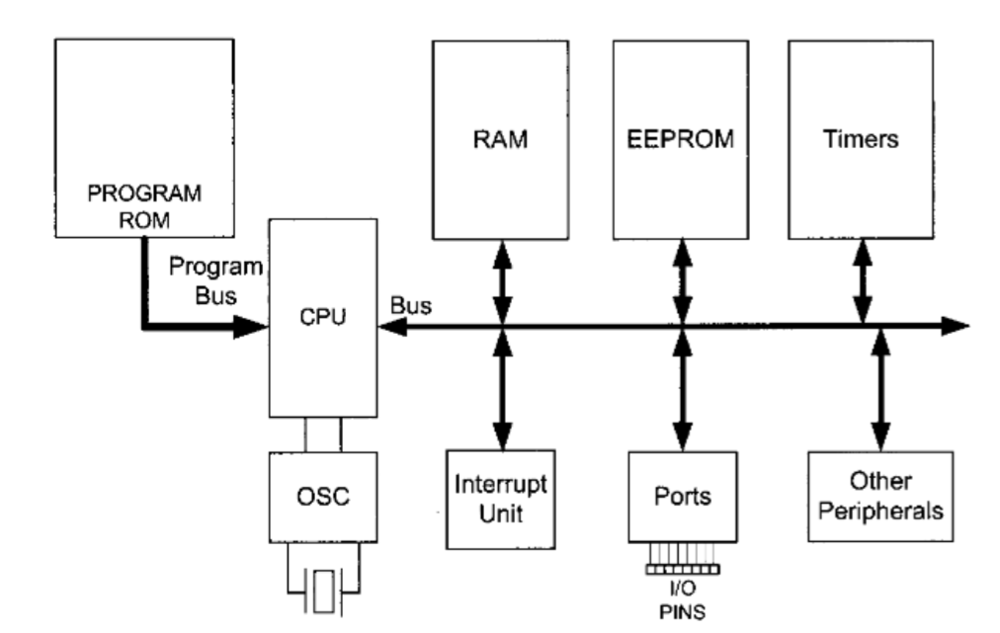
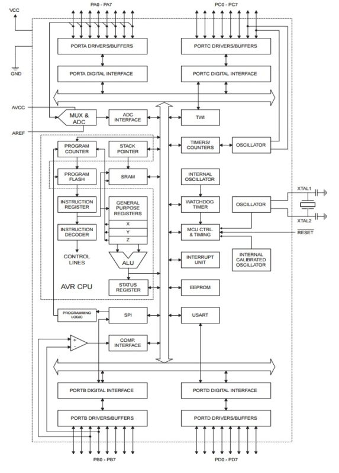
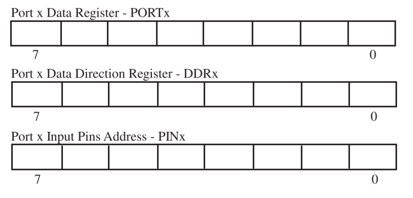

# Chapter 1 AVR Architecture Overview

## 1-1 Introduction

### AVR Classifications

- Classic AVR
- **Mega AVR**
- Tiny AVR
- Special purpose AVR

### AVR Features

- an 8-bit **RISC**[^1] micro controller with *Harvard Architecture*[^2]
- high performance with low power
- has a CPU
- has program ROM, RAM, [EEPROM](#eeprom), Timers and I/O ports
- owns ADC and PWM
- owns serial interfaces: USART, SPI, TWI, etc

## 1-2 ATmega16 Architecture Overview

### RISC Architecture

- **131** RISC-type instructions
- **32** general purpose 8-bit registers
- operates at a clock speed of **16 MHz** or handles 16 million instructions per second

### Assembly Language Instruction Set

- the most efficient and fast execution for a particular micro controller
- need to be familiar with the low-level architecture details of the controller
- C language is easier to read and transfer

### ATmega16 Architecture Overview

- a timer subsystem
- a communication system
- an interrupt subsystem
- an analog-to-digital converter (ADC)
- memory components

#### Pins

- four 8-bit ports (PORTx)
- connections for power supplies (VCC/GND/AVCC/AREF)
- external time base input pins (XTAL1/XTAL2)
- processor reset (RESET)

## 1-3 Memory Components

### EEPROM

**EEPROM**, stands for electrically erasable programmable read-only memory and is a type of **non-volatile** memory used in computers, integrated in micro controllers for smart cards and remote keyless systems, and other electronic devices to store relatively small amounts of data by allowing individual bytes to be erased and reprogrammed.

#### Programmable Flash EEPROM

- 16K bytes
- 10 000 write/erase cycles
- stores on-chip boot program

#### Byte-Addressable EEPROM

- 512 bytes
- 100 000 write/erase cycles
- logs system malfunctions and fault data during program execution
- stores data must be retained during a power failure but might need to be changed periodically

### SRAM

Static random-access memory (static RAM or **SRAM**) is a type of random-access memory (RAM) that uses latching circuitry (flip-flop) to store each bit. SRAM is **volatile** memory; data is lost when power is removed.[^3]

- 1000 bytes
- read and be written data during program execution
- protected by programming lock

### Programmable Lock Bits

- six memory lock bits for memory security from tampering
- Atmel STK500 programming board used to program lock bits

## 1-4 Port System

ATmega16 is equipped with **four** 8-bit general-purpose, digital I/O ports designated PORTA, PORTB, PORTC, and PORTD. And each port has **8 data pins** and is bi-directional.

### Data Register

PORTx, used to write output data to the port

### Data Direction Register

DDRx, used to set specific port pin to either output (1) or input (0)

### Input Pin Address

PINx, used to read input data from the port

### Port Pin Configuration

| DDRxn | PORTxn |  I/O   |                 Comment                 |
| :---: | :----: | :----: | :-------------------------------------: |
|   0   |   0    | input  |            Tri-state (Hi-Z)             |
|   0   |   1    | input  | source current if externally pulled low |
|   1   |   0    | output |            Output Low (Sink)            |
|   1   |   1    | output |          Output High (Source)           |

- x: port designator (A, B, C, D)
- n: pin designator (0 - 7)

[^1]: 
    **RISC**, acronym for Reduced-instruction-set Computing, information processing using any of a family of microprocessors that are designed to execute computing tasks with the simplest instructions in the shortest amount of time possible. RISC is the opposite of **CISC** (Complex-instruction-set Computing).
[^2]:
    **Harvard architecture** is a computer architecture with separate storage and signal pathways for instructions and data. It contrasts with the **von Neumann architecture**, where program instructions and data share the same memory and pathways.
[^3]:
    The term static differentiates **SRAM** from **DRAM** (dynamic random-access memory) which must be **periodically** refreshed. SRAM is faster and more expensive than DRAM; it is typically used for the cache and internal registers of a CPU while DRAM is used for a computer's main memory.