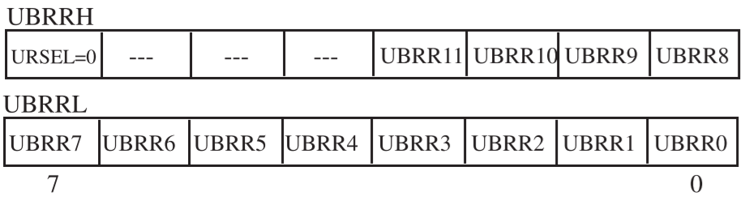
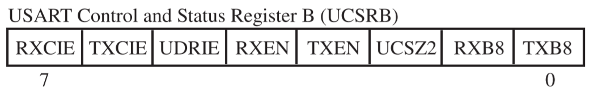
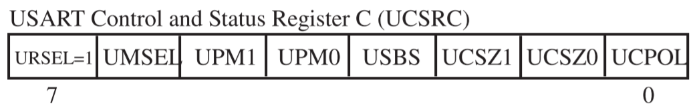
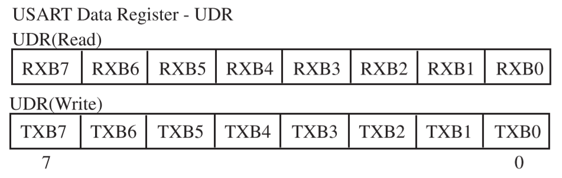
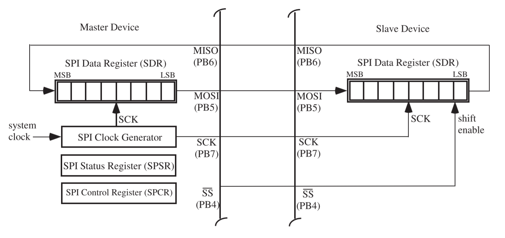
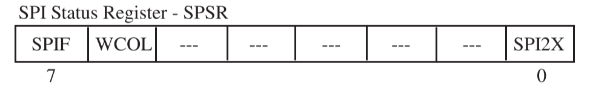

# Chapter 2

## 2-1 Serial Communications

Micro controllers transfer data in two ways: **parallel** and **serial**

- parallel: several data bits are transferred simultaneously
- serial: a single data bit is transferred at one time

Advantages of serial communication

- longer distances
- easier to synchronize
- fewer I/O pins and lower cost

Serial communication often requires

- **shift registers**: convert a byte to a serial bits and vice versa
- **modems**: modulate/demodulate serial bits to/from audio tones

## 2-2 Serial Communication Terminology

### Asynchronous versus Synchronous

- Synchronous serial communication
  - the clocks of the sender and receiver are synchronized
  - a clock of characters, enclosed by synchronizing bytes, is sent at a time
  - faster transfer and less overhead
- Asynchronous serial communication
  - the clocks of the sender and receiver are not synchronized
  - one character is sent at a time, enclosed between a start bit and one or two stop bits, a parity bit may be included

### Baud Rate

Data transmission rates are typically specified as a **baud** or bits per second rate

### Full Duplex

A **single duplex** system has a single complement of hardware that must be switched from transmission to reception configuration

A **full duplex** serial communication system has separate hardware for transmission and reception

### Nonreturn to Zero Coding Format

The ATmega16 uses a **nonreturn to zero coding** standard, coding a logic 1 is signaled by a logic high during the entire time slot allocated for a single bit, whereas a logic 0 is signaled by a logic low during the entire time slot allocated for a single bit.

### RS-232 Communication Protocol

The RS-232 is a widely used standard for serial interfacing, which covers four main aspects

- Electrical: voltage level, rise and fall time, data rate and distance
- Functional: function of each signal
- Mechanical: number of pins, shape and dimension of connectors
- Procedural: sequence of events for transmitting data

| Logic | RS-232 Levels |  TTL Levels  |
| :---: | :-----------: | :----------: |
|   1   | $[-15V,-3V]$  | $[+2V,+5V]$  |
|   0   | $[+3V,+15V]$  | $[0V,+0.8V]$ |

### Parity

- Parity Bit: a single bit for error checking, sent with data bits to make the total number of 1's
- Start Bit: the **indication** of the start of a character
- Stop Bit: the **indication** of the end of a character

## 2-3 Serial USART

### Hardware Elements

There are mainly **four** basic pieces in USART

- the clock generator
- the transmission hardware
- the receiver hardware
- three control registers (UCSRA, UCSRB and UCSRC)

#### Clock Generator

- provide clock source
- set **baud rate** using UBRR register

#### Transmitter

- send a character through **TxD** pin
- handle start/stop bits and parity bit, and shift register

#### Receiver

- receive a character through **RxD** pin
- perform the reverse operation of the transmitter

#### Registers

- configure, control and monitor the serial USART

### Registers

#### Baud Rate Registers

<div align = center></div>

| Bit Number | Register Bit |    Register Bit Name     |                                   Function                                    |
| :--------: | :----------: | :----------------------: | :---------------------------------------------------------------------------: |
|     15     |    URSEL     |     Register Select      | Must be set to 0 to write to UBRRH, which shares the same location with UCSRC |
|   14:12    |              |      Reversed Bits       |                    Theses bits are reserved for future use                    |
|    11:0    |  UBRR 11:0   | USART Baud Rate Register |         This is a 12-bit register which contains the USART baud rate          |

The following table contains the equations for calculating baud rate register setting

|             Operating Mode             |               Calculate Baud Rate               |             Calculate UBRR Value              |
| :------------------------------------: | :---------------------------------------------: | :-------------------------------------------: |
| Asynchronous Normal ($\text{U2X} = 0$) | $\text{BAUD}=\frac{f_{OSC}}{16(\text{UBRR}+1)}$ | $\text{UBRR}=\frac{f_{OSC}}{16\text{BAUD}}-1$ |
| Asynchronous Double ($\text{U2X} = 1$) | $\text{BAUD}=\frac{f_{OSC}}{8(\text{UBRR}+1)}$  | $\text{UBRR}=\frac{f_{OSC}}{8\text{BAUD}}-1$  |
|           Synchronous Master           | $\text{BAUD}=\frac{f_{OSC}}{2(\text{UBRR}+1)}$  | $\text{UBRR}=\frac{f_{OSC}}{2\text{BAUD}}-1$  |

- BAUD: Baud rate (in bits per second)
- $f_{OSC}$: System Oscillator clock frequency
- UBRR: Contents of the UBRRH and UBRRL Registers $[0,2^{11}-1]$

#### USART Control and Status Register A (UCSRA)

<div align = center></div>

| Bit Number | Register Bit |          Register Bit Name          |                      Function                       |
| :--------: | :----------: | :---------------------------------: | :-------------------------------------------------: |
|     7      |     RXC      |       USART Receive Complete        | 1 when receive buffer has unread data (Rx complete) |
|     6      |     TXC      |       USART Transmit Complete       | 1 when no new data in transmit buffer (Tx complete) |
|     5      |     UDRE     |      USART Data Register Empty      |         1 when USART data register is empty         |
|     4      |      FE      |             Frame Error             |             1 when there is frame error             |
|     3      |     DOR      |            Data Over-Run            |            1 when there is data overrun             |
|     2      |      PE      |            Parity Error             |            1 when there is parity error             |
|     1      |     U2X      | Double the USART Transmission Speed |         1 to double the transmission speed          |
|     0      |     MPCM     | Multi-processor Communication Mode  |   1 to enable multi-processor communication mode    |

#### USART Control and Status Register B (UCSRB)

<div align = center></div>

| Bit Number | Register Bit |            Register Bit Name             |                                        Function                                        |
| :--------: | :----------: | :--------------------------------------: | :------------------------------------------------------------------------------------: |
|     7      |    RXCIE     | USART Receive Complete Interrupt Enable  | 1 to enable RX Complete Interrupt, valid only if Global Interrupt Flag = 1 and RXC = 1 |
|     6      |    TXCIE     | USART Transmit Complete Interrupt Enable | 1 to enable TX Complete Interrupt, valid only if Global Interrupt Flag = 1 and TXC = 1 |
|     5      |    UDRIE     |        USART Data Register Empty         |                    1 to enable USART Data Register Empty Interrupt                     |
|     4      |     RXEN     |             Receiver Enable              |                               1 to enable USART receiver                               |
|     3      |     TXEN     |            Transmitter Enable            |                             1 to enable USART transmitter                              |
|     2      |    UCSZ2     |              Character Size              |        bit UCSZ2 to decide character size, combined with bits 2 and 1 in UCSRC         |
|     1      |     RXB8     |            Receive Data Bit 8            |                       Rx extra data bit for 9-bit character size                       |
|     0      |     MPCM     |    Multi-processor Communication Mode    |                       Tx extra data bit for 9-bit character size                       |

#### USART Control and Status Register C (UCSRC)

<div align = center></div>

| Bit Number | Register Bit | Register Bit Name |                                    Function                                     |
| :--------: | :----------: | :---------------: | :-----------------------------------------------------------------------------: |
|     7      |    URSEL     |  Register Select  |           Must be set to 1 to write to UCSRC, which shares with UBRRH           |
|     6      |    UMSEL     | USART Mode Select |              To select USART modes: 0 asynchronous, 1 synchronous               |
|    5:4     |    UPM1:0    |    Parity Mode    | To select parity mode: 00 no parity, 10 even parity, 11 odd parity, 01 Reserved |
|     3      |     USBS     |  Stop Bit Select  |             To select stop bit mode: 0->1 stop bit, 1->2 stop bits              |
|    2:1     |   UCSZ1:0    |  Character Size   |                Used with UCSZ2 in UCSRB to select character size                |
|     0      |    UCPOL     |  Clock Polarity   |                         Used for synchronous mode only                          |

##### Setting Character Size

| UCSZ2 | UCSZ1 | UCSZ0 | Character Size |
| :---: | :---: | :---: | :------------: |
|   0   |   0   |   0   |     5-bit      |
|   0   |   0   |   1   |     6-bit      |
|   0   |   1   |   0   |     7-bit      |
|   0   |   1   |   1   |     8-bit      |
|   1   |   0   |   0   |    Reserved    |
|   1   |   0   |   1   |    Reserved    |
|   1   |   1   |   0   |    Reserved    |
|   1   |   1   |   1   |     9-bit      |

#### USART I/O Dat Registers (UDR)

<div align = center></div>

Register UDR is the buffer for characters sent received through the serial port

##### Sending Character

```C
unsigned char data;
data = 'a';
UDR = data; // start sending character
```

##### Receiving Character

```C
unsigned char data;
data = UDR; // clear UDR
```

### System Operation and Programming

There are 3 main tasks in using the serial port

#### USART Initialization

```flow
st=>start: Begin
op1=>operation: Set USART communication parameters
op2=>operation: Enable transmitter and/or receiver
op3=>operation: Set USART for asynchronous mode
op4=>operation: Set baud rate
e=>end: End
st->op1->op2->op3->op4->e
```

```C
void USART_init(void){
    UCSRA = 0x00; // control register initialization
    UCSRB = 0x08; // enable transmitter
    UCSRC = 0x86; // async, no parity; 1 stop bit, 8 data bits

    UBRRH = 0x00;
    UBRRL = 0x40;
}
```

#### USART Transmission

```flow
st=>start: Begin
cond=>condition: Has UDRE flag set
op=>operation: Load UDR register with data byte for transmission
e=>end: End

st->cond
cond(no)->cond
cond(yes)->op->e
```

```C
void USART_transmit(unsigned char data){
	while((UCSRA & 0x20)==0x00){
		;
	}

	UDR = data;
}
```

#### USART Reception

```flow
st=>start: Begin
cond=>condition: Has RXC flag set
op=>operation: Retrieve received data from UDR register
e=>end: End

st->cond
cond(no)->cond
cond(yes)->op->e
```

```C
unsigned char USART_receive(void){
	while((UCSRA & 0x80) == 0x00){
		;
	}
	unsigned char data = UDR;
	return data;
}
```

## 2-4 Serial Peripheral Interface

The serial peripheral interface allows **high-speed synchronous data transfer** between the ATmega16 and peripheral devices or between several AVR devices. And there are **3 wires** in SPI.

### SPI Operation

<div align = center></div>

```flow
st=>start: Begin
op1=>operation: Enable shift by taking low to SS
op2=>operation: Initialize spi by setting SPCR
op3=>operation: Send system clock through SCK 
op4=>operation: Transmit bits
cond=>condition: Has clock pulses > 8
op5=>operation: Send SPIF to both devices
e=>end: End

st->op1->op2->op3->op4->cond
cond(no)->op4
cond(yes)->op5->e
```

### SPI Registers

#### SPI Control Register (SPCR)

<div align = center></div>

| Bit Number | Register Bit |   Register Bit Name   |                                Function                                |
| :--------: | :----------: | :-------------------: | :--------------------------------------------------------------------: |
|     7      |     SPIE     |                       |
|     6      |     SPE      |      SPI Enable       |              1 to turn on the system and 0 to turn it off              |
|     5      |     DORD     |      Data Order       |              1 to send LSB first and 0 to send MSB first               |
|     4      |     MSTR     |  Master/Slave Select  |                      1 for master and 0 for slave                      |
|     3      |     CPOL     |    Clock Polarity     |         1 for idle logic high of SCK and 0 for idle logic low          |
|     2      |     CPHA     |      Clock Phase      | if data will be sampled on leading (0) or trailing (1) edge of the SCK |
|    1:0     |    SPR1:0    | SPI Clock Rate Select |                    used to set the division factor                     |

#### SPI Status Register (SPSR)

<div align = center></div>

| Bit Number | Register Bit | Register Bit Name  |            Function            |
| :--------: | :----------: | :----------------: | :----------------------------: |
|     7      |     SPIF     | SPI Interrupt Flag | set when transmission finished |
|     6      |     WCOL     | Writing Collision  |                                |
|    5:1     |   Reserved   |                    |
|     0      |    SPI2X     |  Double SPI Speed  |     set the SCK frequency      |

#### SPI Data Register (SPDR)

<div align = center></div>

Writing a data byte to the SPDR initiates SPI transmission

#### SCK Frequency

The SPR 1:0 bits and the SPI2X bit are used to set the division factor

| SPI2X | SPR1  | SPR0  |    SCK Frequency     |
| :---: | :---: | :---: | :------------------: |
|   0   |   0   |   0   | $\frac{1}{4}f_{OSC}$ |
|   0   |   0   |   1   | $\frac{1}{16}f_{OSC}$ |
|   0   |   1   |   0   | $\frac{1}{64}f_{OSC}$ |
|   0   |   1   |   1   | $\frac{1}{128}f_{OSC}$ |
|   1   |   0   |   0   | $\frac{1}{2}f_{OSC}$ |
|   1   |   0   |   1   | $\frac{1}{8}f_{OSC}$ |
|   1   |   1   |   0   | $\frac{1}{32}f_{OSC}$ |
|   1   |   1   |   1   | $\frac{1}{64}f_{OSC}$ |

### Coding with SPI

```C
void SPI_init(unsigned char control){
	DDRB = 0xA0; // SCK(PB7), MOSI(PB5) for output, others to input
	SPCR = 0x53; // SPIE:0, SPE:1, DORD:0, MSTR:1, CPOL:0, CPHA:0, SPR:1, SPR0:1
}

void SPI_write(unsigned char byte){
	SPDR = byte;
	while(!(SPSR & 0x80)){
		;
	}
}

unsigned char SPI_read(void){
	while(!(SPSR & 0x80)){
		;
	}

	unsigned char data = SPDR;
	return data;
}
```

## 2-5 Two-Wire Serial Interface

The TWI subsystem allows the system designer to network a number of related devices  together into a system using a **two-wire** interconnecting scheme. 

The TWI allows a maximum of **128 devices** to be connected together. Each device has its own unique address and may both transmit and receive over the two-wire bus at frequencies up to **400 kHz**. 

### TWI Bus

<div align = center></div>

The TWI protocol allows the systems designer to interconnect up to 128 different devices using only two bi-directional bus lines, one for clock (**SCL**) and one for data (**SCA**)

The only external hardware needed to implement the bus is as single pull-up resistor for each of the TWI bus lines.