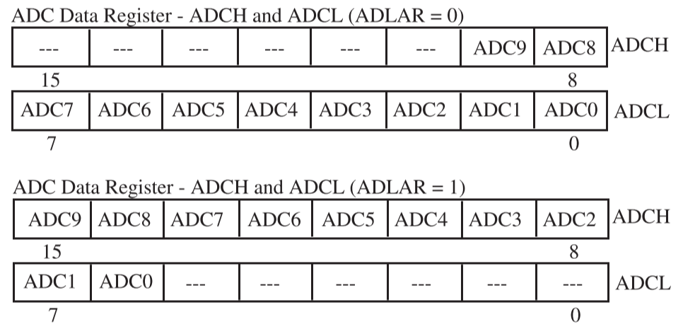

# Chapter 3

## 3-1 Analog to Digital Conversion Process

The goal of the ADC process is to accurately represent analog signals as digital signals. And there are three signal processing procedures: **sampling**, **quantization** and **encoding**.

### Transferring

But before the ADC process takes place, the physical signal must be converted into an electrical signal with the help of the **transducer**

A **transducer** is an electrical and/or mechanical system that converts physical signals into electrical signals or electrical signals to physical signals.

### Conditioning

In addition to transducers, we also need signal conditioning circuity before we apply the ADC/DAC process. The signal conditioning circuity is called the **transducer interface**.

The objective of the **transducer interface** circuit is to **scale and shift** the electrical signal range to map the **output of the input transducer** to the **input of the ADC**.

<div align = center></div>

In general, the scaling and bias process may be described by two equations

$$
\begin{cases}
    V_{2\; max} &= (V_{1\; max}\times K)+B\\[2ex]
    V_{2\; min} &= (V_{1\; min}\times K)+B
\end{cases}
$$

- $V_{1\; max}$: the maximum output voltage from the input transducer
- $V_{1\; min}$: the minimum output voltage from the input transducer
- $V_{2\; max}$: the maximum output voltage of the input voltage of ADC
- $V_{2\; min}$: the minimum output voltage of the input voltage of ADC

### Sampling

<div align = center></div>

The first step of the ADC process is the sampling of the analog signal. When selecting a converter, one must consider the type of physical signal that is being converted to properly ensure the sampling rate. 

Using the proper sampling rate is the first step that determined whether an analog signal will be represented correctly in digital systems，which means to select an ADC that can handle a required conversion rate

### Quantization

<div align = center></div>

Once the analog signal has been sampled, the quantization process takes place. For this process, again one must decide how much quantization error can be allowed.

To determine the number of bits and its corresponding maximum quantization error, we use the following equation

$$
\text{Resolution} = \frac{\text{range}}{2^b}
$$

- $b$: the encoding bits

### Encoding

<div align = center></div>

Once the quantization level has been determined, we can now encode it using the available bits.

## 3-2 ADC Conversion Technologies

There are numerous types of conversion process in ADC: the **successive approximation conversion**, **integration conversion**, **counter-based conversion** and **parallel conversion**

### Successive Approximation

<div align = center></div>

The successive approximation technique uses a DAC, a controller and a comparator to perform the ADC process.

1. Starting from MSB to LSB, the controller turns on each bit at a time and generates an analog signal
2. Using DAC, the analog signal is conversed to the analog signal
3. The comparator then compares the analog input signal and the "analog signal" and sends feedback to the controller
4. Based on the result of the comparison, the controller changes or leaves the current bit and turns on the next MSB

- advantage: the conversion time is uniform for any input
- disadvantage: the use of complex hardware for implementation

### Integration

<div align = center></div>

The integration technique uses an integrator, a comparator, and a controller to convert analog signals to digital signals

1. The analog signal is integrated over a fixed period
2. The fixed reference signal is also integrated over time and compared with the input analog signal
3. When the two integrated values equal, the measured time of the fixed reference signal is converted to a digital encoded value.

- disadvantage: the varying time for the conversion process

### Counter-Based Conversion

<div align = center></div>

The third technique to convert an analog signal to a digital signal is the counter-based conversion. This conversion is performed with the help of a counter, a DAC, and a comparator.

1. The counter starts at 0 and counts up
2. As the counter counts up, the corresponding value is converted to an analog value and compared with an input analog signal
3. As long as the input analog signal is greater than the signal generated by the DAC, the counter counts up and the process continues
4. When the comparator detects that the signal from the DAC is greater than the input analog signal, the counter value is then converted to a digital value representing the sampled analog signal

- disadvantage: the varying time for the conversion process

### Parallel Conversion

<div align = center></div>

A parallel converter uses a large number of comparators and circuity to simultaneously measure the input signals and convert it to a digital value

- advantage: the quickest conversion time
- disadvantage: the cost involved in building the circuity

## 3-3 ATMEL ATmega16 ADC System

ATmega16 is equipped with a flexible and powerful ADC system, which has the following features

- 10 bit resolution
- $\pm2$ LSB absolute accuracy
- 13 ADC clock rate cycle conversion time
- 8 multiplexed single-ended input channels
- selectable right or left result justification
- 0 to $V_{cc}$ ADC input voltage range

where the resolution is

$$
\text{resolution} = (V_{RH}-V_{RL})/2^b
$$

- $V_{RH}$: ADC high reference voltage
- $V_{RL}$: ADC low reference voltage
  
<div align = center></div>

### Registers

#### ADC Multiplexer Selection Register (ADMUX)

<div align = center></div>

| Bit Number | Register Bit |         Register Bit Name          |                         Function                          |
| :--------: | :----------: | :--------------------------------: | :-------------------------------------------------------: |
|    7:6     |   REFS1:0    |      Reference Voltage Source      | Determine the reference voltage source for the ADC system |
|     5      |    ADLAR     |       ADC Left Adjust Result       |       1 for left justification and 0 for right one        |
|    4:0     |   MUX 4:0    | ADC Multiplexer Selection Register |          Select the analog input for conversion           |

The bits of REFS may be set to the following values

- REFS[1:0]=00: AREF used for ADC voltage reference
- REFS[1:0]=01: AVCC with external capacitor at the AREF pin
- REFS[1:0]=10: reversed
- REFS[1:0]=11: internal 2.56V DC voltage reference with an external capacitor at the AREF pin

#### ADC Control and Status Register A (ADCSRA)

<div align = center></div>

| Bit Number | Register Bit |    Register Bit Name    |                   Function                   |
| :--------: | :----------: | :---------------------: | :------------------------------------------: |
|     7      |     ADEN     |       ADC Enable        | Enable/Disable the ADC system by setting 1/0 |
|     6      |     ADSC     |  ADC Start Conversion   |         Initiate ADC by setting to 1         |
|     5      |    ADATE     | ADC Auto Trigger Enable |      Set 1 to enable auto triggering in ADC       |
|     4      |     ADIF     |   ADC Interrupt Flag    |      Set to 1 when the ADC is complete       |
|     3      |     ADIE     |  ADC Interrupt Enable   | Set to 1 to enable the interrupt of the ADC  |
|    2:0     |   ADPS2:0    |  ADC Prescaler Select   |      Use to set the ADC clock frequency      |

- ADPS[2:0]=000: devision factor 2
- ADPS[2:0]=001: devision factor 2
- ADPS[2:0]=010: devision factor 4
- ADPS[2:0]=011: devision factor 8
- ADPS[2:0]=100: devision factor 16
- ADPS[2:0]=101: devision factor 32
- ADPS[2:0]=110: devision factor 64
- ADPS[2:0]=111: devision factor 128

#### ADC Data Register (ADCH and ADCL)

<div align = center></div>

## 3-4 Programming the ADC

### Initiate ADC

```C
void InitADC(void){
    ADMUX = 0x00;
    ADCSRA = 0xC3; // 0b 1100 0011

    while(!(ADCSRA & 0x10)) // check is conversion is ready
        ;
    
    ADCSRA |= 0x10; // clear the conversion ready flag
}
```

### Read ADC

```C
unsigned int ReadADC(unsigned char channel){
    unsigned int binary_weighted_voltage
    unsigned int binary_weighted_voltage_low;
    unsigned int binary_weighted_voltage_high;

    ADMUX = channel;
    ADCSRA |= 0x43; // 0b 0100 0011

    while(!(ADCSRA & 0x10))
        ;

    ADCSRA |= 0x10;

    binary_weighted_voltage_low = ADCL;
    binary_weighted_voltage_high = ((unsigned int)(ADCH << 8));

    binary_weighted_voltage = binary_weighted_voltage_low | binary_weighted_voltage_high;

    return binary_weighted_voltage;
}
```