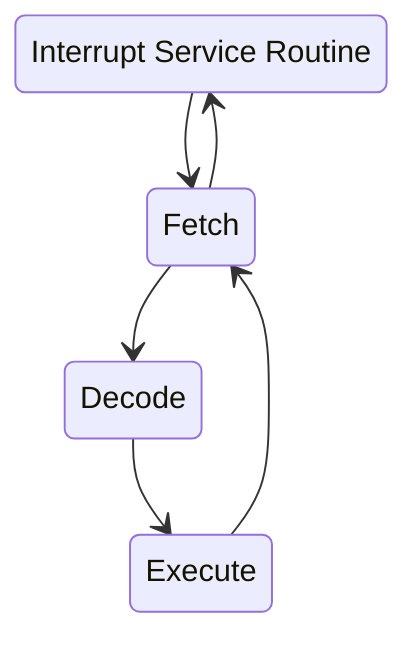
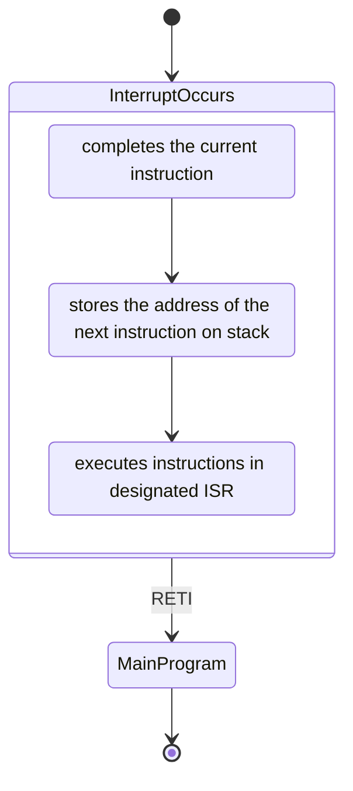

# Chapter 4

## 4-1 Interrupt Theory

A microcontroller normally executes instructions in an orderly **fetch-decode-execute** sequence, but it must be equipped to handle unscheduled, high-priority events thant might occur inside or outside. Therefore, a microcontroller requires an interrupt system



## 4-2 ATmega16 Interrupt System

The ATmega16 is equipped 21 interrupt sources. **Three** originate from external interrupt sources, the remaining **eighteen** interrupts interrupts onboard.

<div align = center></div>



- ISR: interrupt service routine
- RETI: return from interrupt instruction

## 4-3 Programming An Interrupt

- Ensure the ISR for a specific interrupt is tied to the correct interrupt vector address, which points to the starting address of the ISR
- Ensure the interrupt system has been globally enabled, which is accomplished with the assembly language instruction SEI
- Ensure the specific interrupt subsystem has been locally enabled
- Ensure the registers associated with the specific interrupt have been configured correctly

### External Interrupts

<div align = center></div>

```C
#pragma interrupt_handler int0_ISR:2 // interrupt handler definition

void int0_Init(void);
void int0_ISR(void);

void int0_Init(void){
    DDRD = 0xFB;    // Set PD2 as input
    PORTD &= ~0x04; // Disable pull-up resistor of PD2

    GICR = 0x40;    // Enable INT0
    MCUCR = 0x03;   // Set for rising edge

    asm("SEI");     // Enable global interrupt
}

void int0_ISR(void){
    /**
     * Insert interrupt specific actions here
     */
}
```

### Internal Interrupts

```C
#pragma interrupt_handler timer0_interrupt_isr:10

typedef unsigned char u8;
typedef unsigned int u16;

void delay(u16 number_of_interrupts);
void timer0_Init(void);

u16 input_delay;

void timer0_Init(void){
    TCCR0 = 0x04; // divide timer0 timebase by 256
    TIMSK = 0x01; // enable timer0 overflow interrupt

    asm("SEI");
}

void delay(u16 number_of_interrupts){
    TCNT = 0x00;     // reset timer0
    input_delay = 0; // reset timer0 overflow counter

    while(input_delay <=number_of_interrupts)
        ;
}

void timer0_interrupt_isr(void){
    input_delay++;
}

```

