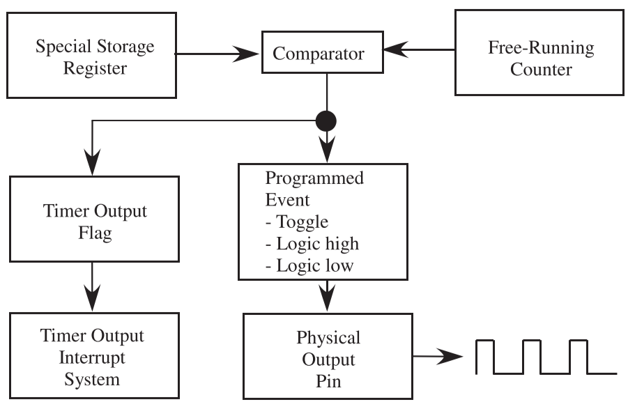
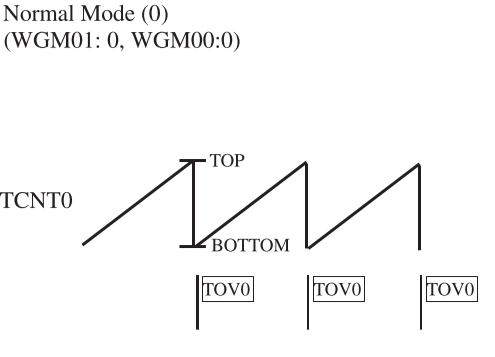
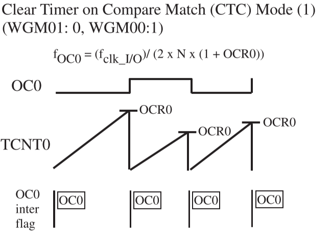
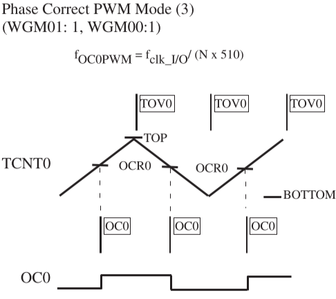
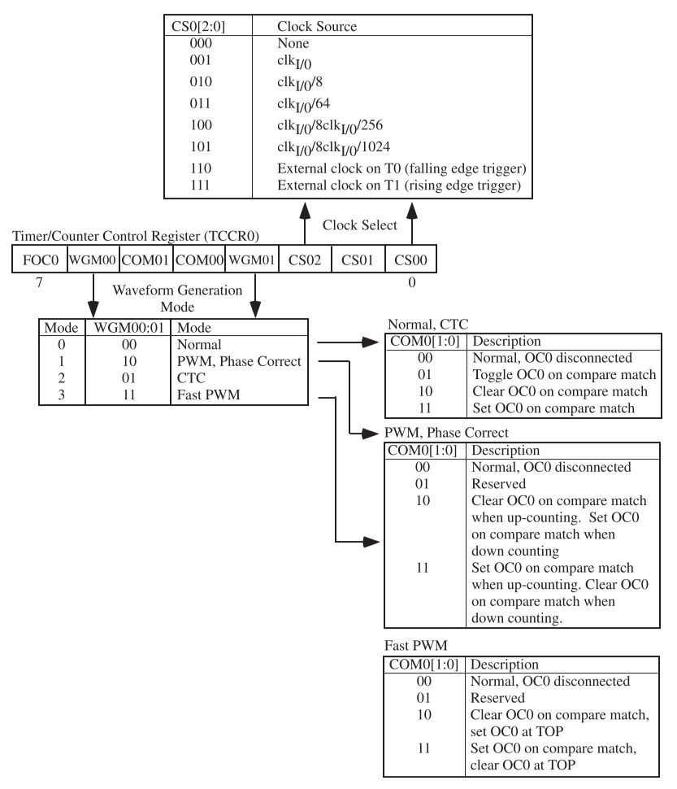
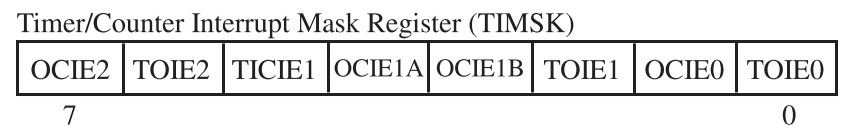
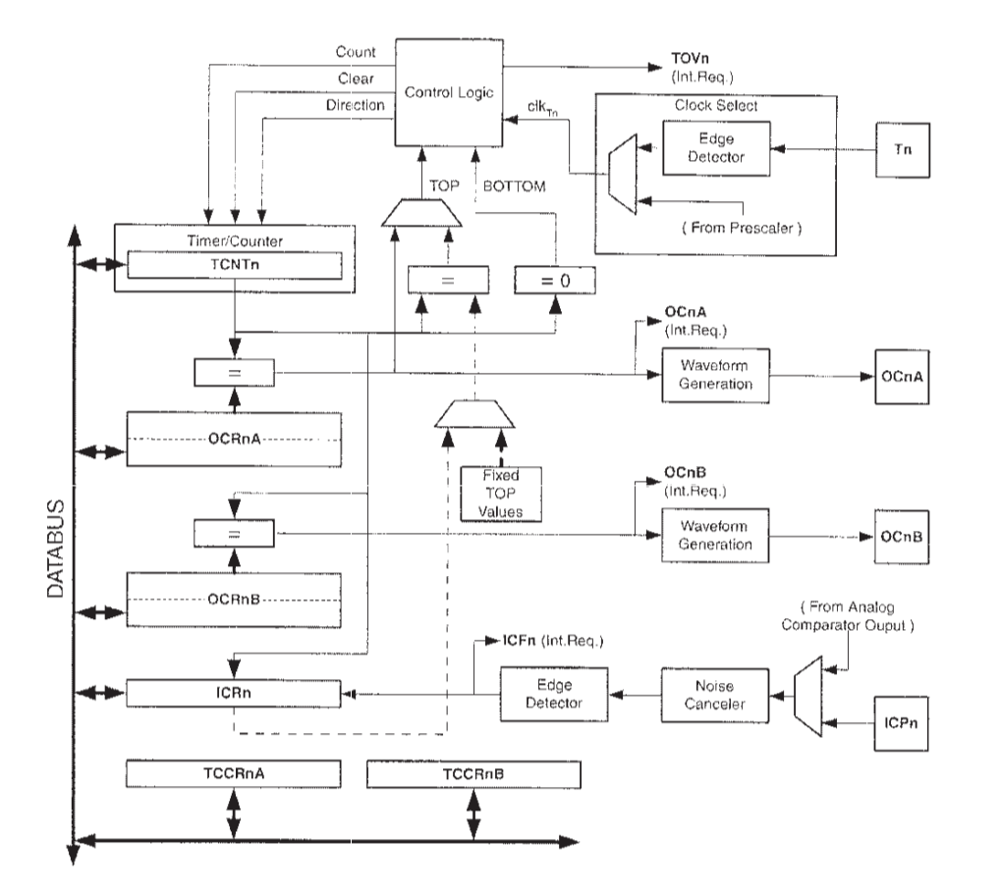

# Chapter 5

## 5-1 Timing-Related Terminology

### duty Cycle

To control the direction and sometimes the speed of a motor, a **periodic pulse** with a **changing duty cycle** over time is used.

- (a): the periodic signal with $50\%$ duty cycle
- (b): the periodic signal with $25\%$ duty cycle

## 5-2 Timing System Overview

The very heart of the timing system is the crystal time base, which is used to generate a baseline clock signal for the microcontroller.

For a timer system, the system clock is used to update the contents of a special register which is called a **free-running counter**.

The job of a free-running counter is to count each time it sees a **rising/falling edge** of a clock signal, where other timer-related units reference it to perform I/O time-related activities: measurements, capture of timing events and generation of time-related signals

### Input Time-Related Activities

All microcontrollers typically have timer hardware components, based on a free-running counter to capture external event times, that detect signal logic changes on one or input pins. 

We can use such ability to measure the **period of an incoming signal**, the **width of a pulse** and the **time of a signal logic change**.

### Output Timer Functions

The microcontroller uses a comparator to check the value of the free-running counter for a match with the contents of another special-purpose register where a programmer stores a specified time in terms of free-running counter value.

The checking process is executed at each clock cycle, and when a match occurs, the corresponding hardware system induces a programmed logic change on a programmed output port pin.

Using such capability, one can generate a simple logic change at designated time incident or a PWM signal to control DC motors

## 5-3 Applications

### Input Capture

- an input signal is connected to pin, called input capture, of the timer
- an interrupt triggered when there's a change in **interrupt capture pin**
- when a preset event occurs on this pin, the current timer value is stored in a register

### Output Compare

- a timer usually has a pin which is called output compare
- the output compare could be used to generate time critical signals for external devices
- when the timer reaches a preset value, the output compare pin can be automatically changed to logic 0 or logic 1
- output compare allows custom processing to be done when the timer reaches a preset target value

### Counting Event

- the timer could be used to count external events
- the polling technique or the interrupt technique could be used to count events

### Pulse Width Modulation

- the timer could be used to generate an PWM signal with the desired duty cycle
- PWM signal is the most common way to control industrial devices

## 5-4 The ATmega 16 Timers

The ATMEL ATmega16 is equipped with a flexible and powerful three-channel timing Timer 0, Timer 1 and Timer 2.

Both timer 0 and timer 2 are 8-bit timers, and the timer 1 is the 16-bit timer. Each timer is equipped with a prescaler, which is used to subdivide the main controller clock source down to the clock source for the timing system.

Each timing system has the capability to generate PWM signals, signal with a specific frequency, counting events and generate a precision signal. And the timer 1 is equipped with the input capture feature.

All timing could be configured into four modes: Normal, Clear TImer on Compare Match, Fast PWM.

### Basic Operation Modes

#### Normal Mode

The timer will continually counts from BOTTOM to TOP

As the TCNTx returns to 0 on each time cycle, the Timer/Counter Overflow Flag (TOVx) will be set

#### Clear Timer on Compare Match

TCNTx will be reset to 0 any time when it reaches to the value in OCR0

And the Output Compare Flag x (OCFx) is set when the reset occurs, which is enabled in Timer/Counter x Output Compare Match Interrupt Enable (OCIEx) flag in the TIMSK

#### Phase Correct PWM Mode

TCNTx register will counts from BOTTOM to TOP, then decreases to BOTTOM continuously

Every time the TCNTx value matches the value set in the OCRx register, the OCFx is set

#### Fast PWM Mode

When the TCNTx register value reaches the value set in OCRx register, it will cause a change in the PWM output.

And the TCNTx  continues to count up to the TOP value, at which time the Timer/Counter x Overflow Flag (TOVx) is set

### Timer 0/2

- 8-bit timer/counter
- 10-bit clock prescaler
- Functions:
  - Pulse width modulation
  - Frequency generation
  - Event counter
  - Output compare
- Modes of operation
  - Normal
  - Clear timer on compare match
  - Fast PWM
  - Phase correct PWM

#### Timer 0/2 Registers

> FOC0/2 could only be active (set to logic one) in non-PWM mode, 

| Bit Number | Register Bit |               Register Bit Name               |                Function                 |
| :--------: | :----------: | :-------------------------------------------: | :-------------------------------------: |
|     7      |    OCIE2     | Timer 2 Output Compare Match Interrupt Enable | 1 to enable the compare match interrupt |
|     6      |    TOIE2     |       Timer 2 Overflow Interrupt Enable       |   1 to enable the overflow interrupt    |
|     1      |    OCIE0     | Timer 0 Output Compare Match Interrupt Enable | 1 to enable the compare match interrupt |
|     0      |    TOIE0     |       Timer 0 Overflow Interrupt Enable       |   1 to enable the overflow interrupt    |

### Timer 1

- 16-bit timer/counter
- 10-bit clock prescaler
- Functions:
  - Pulse width modulation
  - Frequency generation
  - Event counter
  - Output compare - 2 channel
  - Input capture
- Modes of operation
  - Normal
  - Clear timer on compare match
  - Fast PWM
  - Phase correct PWM

#### Input Capture Mode

The input capture feature is used to capture the characteristics of an input signal, including period, frequency, duty cycle, or pulse length, which is accomplished by monitoring for a user-specified edge on the ICP1 microcontroller pin

When the desired edge occurs, the value of the Timer/Counter 1 (TCNT1) register is captured and stored in the Input Capture Register 1 (ICR1)

#### Timer 1 Registers

| Bit Number | Register Bit |                     Register Bit Name                     |                Function                 |
| :--------: | :----------: | :-------------------------------------------------------: | :-------------------------------------: |
|     5      |    TICIE1    |          Timer 1 Input Capture Interrupt Enable           | 1 to enable the input capture interrupt |
|    4:3     |   OCIE1A:B   | Timer 1 Channel A:B Output Compare Match Interrupt Enable | 1 to enable the compare match interrupt |
|     2      |    TOIE1     |             Timer 1 Overflow Interrupt Enable             |   1 to enable the overflow interrupt    |