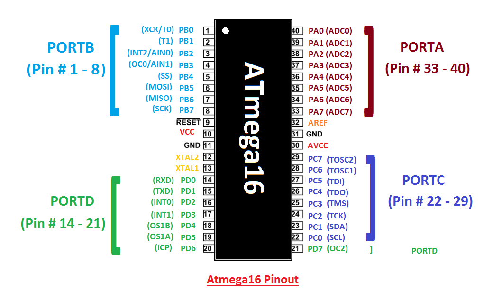
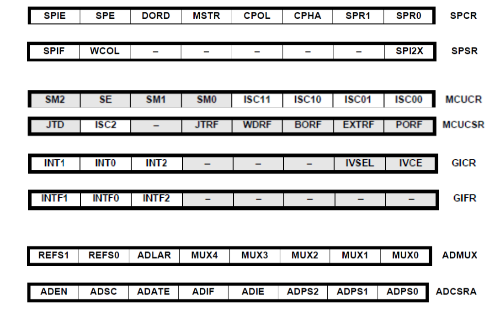
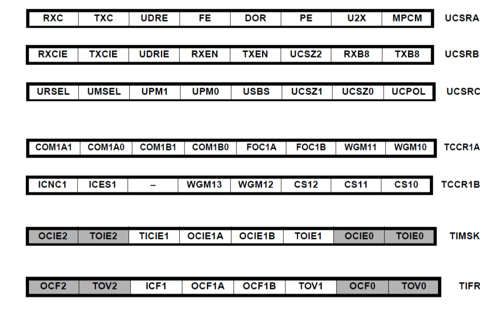

# Quiz

[TOC]
<div align = center></div>
<div align = center></div>
<div align = center></div>

## Chapter 1

### 1-1 How many bits in ATmega16 controller
8

### 1-2 AVR could be classified into
mega, tiny, classic, special-purpose

### 1-3 The ATmega16 contains
timer subsystem, interrupt subsystem, communication subsystem, ADC and memory components

### 1-4 The ATmega16 is equipped with memory components of
In-system Programmable Flash EEPROM, Byte-Addressable EEPROM, Static Random Access Memory

### 1-5 How many PORTs in ATmega16
4, A, B, C and D

### 1-6 How many relevant 8-bit registers for each port?
3, PORTx, PINx, DDRx

### 1-7 How to configure Data Direction Register as a specific port pin as output
DDRxn = 1

### 1-8 Data Register (PORTx) is used to _____ data.
write

### 1-9 Register Input Pin Address (PINx) is used to _____ data.
read

### 1-10 If PORTxn is written logic _____, the port pin is driven high.
1

### 1-11 How many timers/counters in ATmega16?
3, 1 16-bit timer and 2 8-bit timers

### 1-12 How many PWM channels in ATmega16?
4

### 1-13 How many serial communication subsystems in ATmega16?
3, USART, SPI and TWI

### 1-14 How many channels is the ATmega16 ADC equipped?
8

### 1-15 How many interrupt sources in ATmega16?
21, 3 for external and 18 from internal

### 1-16 What is the resolution of ADC in ATmega16?
10-bit

### 1-17 In ATmega16, fixed clock operating frequency is 
1, 2, 4 and 8 MHz

### 1-18 What are serial communication subsystems?
USART, SPI, TWI(IIC)

### 1-19 Write a program to lighten the LED as the button is clicked.

## Chapter 2

### 2-1 ASCII is a standardized _____-bit method of encoding alphanumeric data
7

### 2-2 RS232 Communication Protocol is a _____ communication
serial

### 2-3 What is the voltage levels of RS232 to logic 1 and 0
logic 1 $[-15,-3]$, logic 0 $[3,15]$

### 2-4 What is the voltage levels of TTL to logic 1 and 0
logic 1 $[2,5]$, logic 0 $[0,0.8]$

### 2-5 There are ____ main tasks when using the serial port
3, initialization, transmission and reception

### 2-6 USART mainly consists of  _____ basic pieces
4, the clock generator, transmission hardware, receiver hardware and three control registers (UCSRA, UCSRB, UCSRC), two baud rate registers (UBRRH, UBRRL) and one data register (UDR)

### 2-7 What does the serial communication often require?
shift registers and modems

### 2-8 The transfer of data using parallel lines is _____ (faster/slower) but _____ (more expensive/less expensive)
faster, more expensive

### 2-9 Sending data from a radio station is duplex. True or False?
False, it is simplex since the listener could only receive the message sending from the radio.

### 2-10 In full duplex we must have two data lines, one for transfer and one for receive. True or False?
True

### 2-11 The start and stop bits are used in the _____ (synchronous/asynchronous) method
asynchronous

### 2-12 Assuming that we are transmitting the ASCII letter "E" (0100 0101) in binary with no parity bit and one stop bit, show the sequence of bits transferred serially.
0(start bit)->1->0->1->0->0->0->1->0->1(stop bit)

### 2-13 Which register bit is monitored for sending(transmitting) data
UDRE

### 2-14 Which register bit is monitored for receiving data
RXC

### 2-15 Which register bit is set when transmission is finished?
TXC

### 2-16 What is the definition of the baud rate?
the sending rate of the bytes

### 2-17 How to configure the register in USART to the specific baud rate?
configure the UBRRL and UBRRH with the value of $f_{OSC}/(16\cdot \text{BAUD})−1$ for asynchronous normal mode and change 16 to **8** if in asynchronous double speed mode and 16 to 2 if in synchronous master mode 

### 2-18 How to configure the register such that the USART would send data in 7-bit, double speed, asynchronous, 2 stop bit and even parity at 9600 baud rate

```C
u16 myUBRR = F_CPU/(8*9600)-1;
UBRRL = (u8)(myUBRR);
UBRRH = (u8)(myUBRR>>8);

UCSRA = (1<<U2X);
UCSRB = (1<<TXEN) ;
USCRC = (1<<7)|(0<<UMSEL)|(1<<UPM1)|(1<<USBS)|(1<<UCSZ1);
```

### 2-19 How many wires in SPI
4, MOSI, MISO, SCK(Serial Clock) and $\overline{SS}$(slave select)

### 2-20 How many registers are in SPI
3, SPSR, SPCR and SPDR

### 2-21 In comparison between USART and SPI, which one is faster?
SPI

### 2-22 Which register in SPI is used to monitor the sending/receiving data?
SPIF

### 2-23 How many wires in TWI?
2, SDA and SCL

### 2-24 Write a program of USART initialization, transmission and reception.

### 2-25 Write a program of SPI initialization, transmission and reception.

## Chapter 3

### 3-1 ADC is used to convert _____ signals into _____ signals
analog, digital

### 3-2 What is the sampling theory?
the sampling rate must satisfy the Nyquist sampling rate, which is $\text{Nyquist Rate}=2\times F_{max}$

### 3-3 What is the definition of resolution?
Resolution is the "distance" between two adjacent quantization levels, which is $\text{resolution} = \text{range}/2^n$

### 3-4 How does the input transducer help in the ADC process?
The input transducer converts physical signals into electrical signals, which is **scaled and shifted** to map to the input of ADC

### 3-5 An amplifier provides an output voltage of $0\;V$ and $-2.50\;V$ of output voltage. Please calculate the required values of K and B for this transducer, so it may be interfaced to a microcontroller's ADC system (usually 5 and 0)
  
$$
\begin{cases}
    5.0  = 0\times K +B\\[2ex]
    0.0 = -2.50\times K+B
\end{cases}
$$

### 3-6 How many important processes associated with the ADC?
3, sampling, quantization and encoding

### 3-7 How many different types of technologies are used in ADC?
4, successive approximation conversion, integration conversion, counter-based conversion and parallel conversion

### 3-8 How many ADC channels in ATmega16?
8

### 3-9 The resolution of ADC in ATmega16 is
10 bit

### 3-10 The port of ADC in ATmega16 is
PORT A

### 3-11 The default reference voltage $V_{ref}$ is
$5\;V$

### 3-12 What is the absolute accuracy of ADC in ATmega16?
$\pm2\text{LSB}$

### 3-13 What is the number of the clock cycles in a single ADC conversion?
13

### 3-14 How many groups of relevant ADC registers?
4, ADCMUX (ADC multiplexer selection register), ADCCSA (ADC control and status register), ADCH/L (ADC data register), SFIOR (special function I/O register)

### 3-15 How many functions are needed to operate the ATmega16 ADC system?
2, ADC_Init and ADC_Read

### 3-16 How to configure the register to use reference voltage for ADC
  
```C
    ADMUX = (1<<REFS0)|channel; // AVCC
    ADMUX = channel;            // internal AREF
```

### 3-17 Which flag will be set to 1 when conversion is completed?
ADIF

### 3-18 How many registers in the register SFIOR are used to configure the auto-triggering event of ADC
3, ADTS2:0

### 3-19 How many flags in register ADCSRA specify ADC prescaler selection?
3, ADPS2:0

### 3-20 Please write a program of ADC initialization and reading

## Chapter 4

### 4-1 How many interrupt sources are in ATmega16
21, external 3 and internal 18

### 4-2 How many methods to respond to the interrupt?
2, polling or register an interrupt

### 4-3 What do the internal interrupt include?
Timer/counter overflowed, ADC conversion completed, serial transfer completed and analog comparator

### 4-4 What do the internal interrupt of ATmega16 include?
INT0, INT1 and INT2

### 4-5 How to trigger the external interrupt?
Edge and level could trigger INT0 and INT1, INT2 could only triggered by edge

### 4-6 If 3 interrupts are triggered simultaneously, the interrupt with _____ will execute firstly.
lowest program address, highest priority

### 4-7 In the program, the code of ______ is written to service of handle the interrupt request
ISR

### 4-8 How many steps to program an interrupt?
5 in total
   - Set up the stack
   - Write the ISR
   - Set up the interrupt details
   - Enable the interrupt
   - Enable the global interrupt

### 4-9 Can a pin be triggered if the pin itself is configured as an output/input?
Yes

### 4-10 How many registers are about interrupt in ATmega16?
5, MCUCR (Microcontroller Unit Control Register), MCUCSR (Microcontroller Unit Control and Status Register), GICR (General Interrupt Control Register), SREG (AVR Status Register) and GIFR (General Interrupt Flag Register)

### 4-11 How to enable the global interrupt?  

```C
    sei();
```

### 4-12 How to disable the global interrupt?
 
```C
    cli();
```

### 4-13 INFTx will be reset if
an ISR executed or the flag is written with logic one

### 4-14 The global interrupt bit set in
SREG

### 4-15 Which register is used to check if an interrupt occurs?
GIFR

### 4-16 Draw the circuit of ATmega16 with switches and LED, code a program such the INT0 handles interrupt in any voltage change, INT1 in falling edge.

## Chapter 5

### 5-1 How many Timers/Counters in ATmega16?
3, Timer 0/2 are 8 bit timers and Timer 1 is the 16-bit timer

### 5-2 What functions can a timer have?
Mostly counting events, comparing output, input capture and producing PWM signals

### 5-3 Timing-related terminology include
Frequency, period and duty cycle

### 5-4 What is the definition of the duty cycle?
A duty cycle or power cycle is the fraction of one period in which a signal or system is active

### 5-5 How many interrupt sources are in Timer 0/2
2, TOVx(Timer Overflow Flag) and OCFx(Output Compare Flag)

### 5-6 The maximum frequency of Fast PWM is _____ that of the Phase Correct PWM mode
twice

### 5-7 How many groups of registers are in Timer 0?
4, TCCR0(Timer/Counter Control Register), TIMSK(Timer Interrupt Mask Register)/TIFR(Timer Interrupt Flag Register), TCNT0(Timer/Counter Register) and OCR0(Output Compare Register)

### 5-8 TCCRx is used to
configure the timer operations

### 5-9 TIMSK is used to 
enable and disable the timer interrupt

### 5-10 TIFR is used to
monitor the timer interrupt

### 5-11 TCNTx is used to 
store the current value of the timer

### 5-12 OCRx is used to
store the preset values for output compares

### 5-13 The interrupt sources in Timer 1 contain
4, ICF1, OCF1A, OCF1B and TOV1

### 5-14 How many groups of registers are in Timer 1?
5, TCCR1A/B(Timer/Counter Control Register), TIMSK(Timer Interrupt Mask Register)/TIFR(Timer Interrupt Flag Register), TCNT1(Timer/Counter Register) ,OCR1A/B(Output Compare Register) and ICR1(Input Capture Register)

### 5-15 WGM bits in TCCRx register is used for
Waveform generation mode

### 5-16 COMx bits in TCCRx register is used for
Compare match output mode

### 5-17 CSx bits in TCCRx register is used for
Clock select